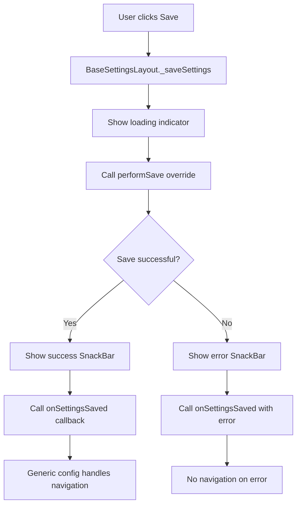

# Generic Settings System - Architecture & Usage

## Tổng quan

Hệ thống Generic Settings đã được nâng cấp để giải quyết các vấn đề về **navigation trùng lặp** và **thiếu chuẩn hóa** trong việc xử lý settings. 

## Nguyên nhân của vấn đề cũ

### Vấn đề Navigation Trùng lặp
```dart
// ❌ VẤN ĐỀ CŨ: Logic navigation bị trùng lặp

// Trong settings layout:
Navigator.of(context).pop(); // Gọi lần 1

// Trong generic config:
onSettingsChanged: (settings) {
  onSettingsChanged(settings);
  Navigator.of(context).pop(); // Gọi lần 2 - TRÙNG LẶP!
}
```

**Kết quả:** Desktop bị black screen, mobile navigation sai logic.

### Vấn đề thiếu chuẩn hóa
- Mỗi settings layout phải tự viết logic save/error handling
- Không có pattern thống nhất cho success feedback
- Khó maintain khi có nhiều settings screens

## Kiến trúc mới

### 1. BaseSettingsLayout<T> - Abstract Base Class

```dart
abstract class BaseSettingsLayout<T> extends StatefulWidget {
  final SettingsSaveCallback<T>? onSettingsSaved;
  final VoidCallback? onCancel;
  final bool showActions;
}

abstract class BaseSettingsLayoutState<W, T> extends State<W> {
  // Tự động xử lý:
  // - Loading state
  // - Change tracking
  // - Save operation với loading indicator
  // - Success/error feedback (using SnackbarUtils)
  // - Navigation thông qua callback
}
```

### 2. SettingsSaveResult<T> - Standardized Result

```dart
class SettingsSaveResult<T> {
  final bool success;
  final T? data;
  final String? errorMessage;
  
  const SettingsSaveResult.success(this.data);
  const SettingsSaveResult.error(this.errorMessage);
}
```

### 3. Cách hoạt động



## Migration Guide

### Cách migrate từ pattern cũ

#### 1. Settings Layout Class

```dart
// ❌ CŨ
class MySettingsLayout extends StatefulWidget {
  final Function(Map<String, dynamic>)? onSettingsChanged;
  final VoidCallback? onCancel;
  final bool showActions;
}

// ✅ MỚI
class MySettingsLayout extends BaseSettingsLayout<Map<String, dynamic>> {
  const MySettingsLayout({
    super.key,
    super.onSettingsSaved,  // Thay đổi từ onSettingsChanged
    super.onCancel,
    super.showActions,
  });
}
```

#### 2. State Class

```dart
// ❌ CŨ
class _MySettingsLayoutState extends State<MySettingsLayout> {
  bool _loading = true;
  bool _hasChanges = false;
  
  @override
  void initState() {
    super.initState();
    _loadSettings();
  }
  
  Future<void> _loadSettings() async { /* manual loading */ }
  Future<void> _saveSettings() async { /* manual save + navigation */ }
}

// ✅ MỚI
class _MySettingsLayoutState extends BaseSettingsLayoutState<
    MySettingsLayout, Map<String, dynamic>> {
  
  @override
  Future<void> loadSettings() async {
    // Chỉ load settings, không cần setState loading
  }
  
  @override
  Future<Map<String, dynamic>> performSave() async {
    // Chỉ save settings, return data
    // Không cần xử lý navigation, success feedback
    return savedData;
  }
  
  @override
  Widget buildSettingsContent(BuildContext context, AppLocalizations loc) {
    // Chỉ build UI content, không cần action buttons
    return yourSettingsUI;
  }
  
  // Change tracking
  void someSettingChanged(value) {
    setState(() {
      _someSetting = value;
    });
    notifyHasChanges(/* check if has changes */);
  }
}
```

#### 3. Generic Config

```dart
// ❌ CŨ
settingsLayout: MySettingsLayout(
  onSettingsChanged: (settings) {
    onSettingsChanged(settings);
    Navigator.of(context).pop(); // Trùng lặp navigation
  },
  onCancel: onCancel ?? () => Navigator.of(context).pop(),
  showActions: showActions,
)

// ✅ MỚI
settingsLayout: MySettingsLayout(
  onSettingsSaved: (result) {
    if (result.success && result.data != null) {
      onSettingsChanged(result.data!);
      Navigator.of(context).pop(); // Chỉ navigation khi thành công
    }
    // Error cases tự động handled bởi BaseSettingsLayout
  },
  onCancel: onCancel ?? () => Navigator.of(context).pop(),
  showActions: showActions,
)
```

## Lợi ích của hệ thống mới

### 1. Đơn giản hóa Settings Layout
- Không cần viết boilerplate code cho loading, saving, error handling
- Chỉ cần implement 3 methods: `loadSettings()`, `performSave()`, `buildSettingsContent()`
- Automatic change tracking với `notifyHasChanges()`

### 2. Consistency
- Tất cả settings screens có cùng UX: loading indicator, success/error feedback với SnackbarUtils
- Standardized navigation pattern
- Consistent save button behavior (disabled khi không có changes, loading indicator khi đang save)
- Unified SnackBar styling với icons và colors

### 3. Maintainability
- Centralized logic trong base class
- Dễ dàng thêm features mới (ví dụ: auto-save, validation) cho tất cả settings
- Single source of truth cho settings behavior

### 4. Error Prevention
- Không thể có navigation trùng lặp
- Type-safe với generic `<T>`
- Proper error handling by default

## Ví dụ thực tế: Random Tools Settings

```dart
class RandomToolsSettingsLayout extends BaseSettingsLayout<Map<String, dynamic>> {
  // Chỉ cần define interface
}

class _RandomToolsSettingsLayoutState extends BaseSettingsLayoutState<
    RandomToolsSettingsLayout, Map<String, dynamic>> {
  
  @override
  Future<void> loadSettings() async {
    final historyEnabled = await GenerationHistoryService.isHistoryEnabled();
    final saveState = await SettingsService.getSaveRandomToolsState();
    // Auto setState và loading management
  }
  
  @override
  Future<Map<String, dynamic>> performSave() async {
    await GenerationHistoryService.setHistoryEnabled(_historyEnabled);
    await SettingsService.updateSaveRandomToolsState(_saveRandomToolsState);
    
    return {
      'historyEnabled': _historyEnabled,
      'saveRandomToolsState': _saveRandomToolsState,
    };
    // Auto success feedback và navigation
  }
  
  @override
  Widget buildSettingsContent(BuildContext context, AppLocalizations loc) {
    return Column(children: [
      // Settings UI
    ]);
    // Auto action buttons (Save/Cancel)
  }
  
  void _onSettingChanged(bool value) {
    setState(() {
      _setting = value;
    });
    notifyHasChanges(/* check changes */); // Tự động enable/disable Save button
  }
}
```

## Future Improvements

1. **Auto-save functionality**: Có thể thêm vào base class
2. **Validation framework**: Validate trước khi save
3. **Undo/Redo**: Dễ dàng implement trong base class
4. **Settings presets**: Load/save different configurations
5. **Real-time sync**: Sync settings across devices
6. **Enhanced SnackBar**: Custom animations và positioning với SnackbarUtils

## Migration Checklist

- [ ] Extend `BaseSettingsLayout<T>` thay vì `StatefulWidget`
- [ ] Extend `BaseSettingsLayoutState<W, T>` thay vì `State<W>`
- [ ] Implement `loadSettings()`, `performSave()`, `buildSettingsContent()`
- [ ] Use `notifyHasChanges()` for change tracking
- [ ] Remove manual navigation logic
- [ ] Update generic config to use `onSettingsSaved` callback
- [ ] Test save/cancel/navigation flow on both desktop và mobile
